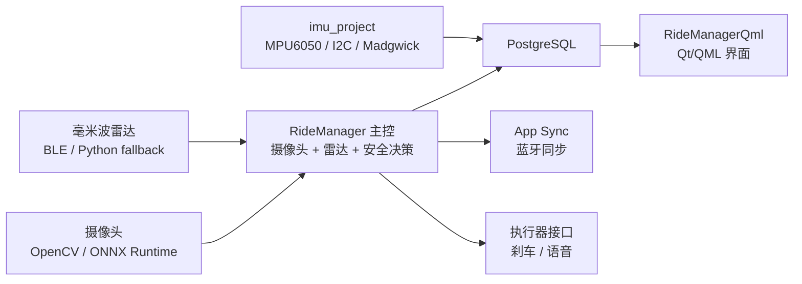

# Y.L.M RideManager 电动车驾驶辅助系统

Y.L.M RideManager 是一个面向嵌入式边缘设备的电动车驾驶辅助系统。项目融合摄像头、毫米波雷达、IMU 姿态数据和安全决策算法，并通过 PostgreSQL 持久化检测结果，Qt/QML 界面用于展示实时状态和历史数据。

本仓库只包含 `Y_L_M_Project` 一个项目目录，主要由三个模块组成：

- `RideManager`：C# 主控程序，负责摄像头、雷达、决策、数据库写入和 App 同步。
- `RideManagerQml`：Qt/QML 可视化界面，读取数据库并展示风险状态、传感器曲线和摄像头识别结果。
- `imu_project`：C++ IMU 采集服务，读取 MPU6050 并将姿态数据写入 PostgreSQL。

## 功能特性

- 多摄像头检测：支持前向道路、驾驶员面部、后向摄像头等配置。
- ONNX 推理：使用 ONNX Runtime 加载目标检测、车道/道路、面部关键点等模型。
- 毫米波雷达：通过 BLE 读取雷达生命体征和距离数据，并支持 Python 蓝牙 fallback。
- IMU 姿态采集：通过 I2C 读取 MPU6050，使用低通滤波和 Madgwick AHRS 输出 roll、pitch、yaw。
- 安全决策：融合摄像头和传感器结果，生成 `Normal`、`Warning`、`Danger` 风险等级。
- 数据持久化：使用 PostgreSQL 保存安全决策、摄像头帧、检测框、传感器快照和指标明细。
- 可视化界面：Qt/QML 界面展示状态卡片、趋势曲线、表格和摄像头识别结果。
- 一键启动：可用脚本同时启动主控、IMU 服务和 Qt 界面。

## 项目结构

```text
Y_L_M_Project
|-- RideManager
|   |-- Program.cs                  # 主控入口
|   |-- RideManager.csproj
|   |-- RideManager.sln
|   |-- config.toml                 # 主控配置
|   |-- src
|   |   |-- camera                  # 摄像头采集、预处理、推理、疲劳估计
|   |   |-- sensors                 # 雷达、陀螺仪等传感器读取
|   |   |-- core                    # 安全决策主逻辑
|   |   |-- data                    # PostgreSQL/EF Core 数据模型和写入
|   |   |-- models                  # ONNX/RKNN 推理封装
|   |   |-- appsync                 # App 蓝牙同步
|   |   |-- actuators               # 刹车/语音等执行器接口
|   |   `-- utils                   # 配置、JSON、HTTP 工具
|   |-- models                      # ONNX 模型文件
|   |-- scripts                     # 数据库初始化、模型转换、雷达诊断脚本
|   |-- docs                        # 模型、数据库、协议说明
|   |-- tests                       # xUnit 单元测试
|   `-- videos                      # 测试视频
|-- RideManagerQml
|   |-- CMakeLists.txt
|   |-- main.cpp
|   |-- Main.qml
|   |-- AppController.*
|   |-- DatabaseManager.*
|   |-- *Model.*                    # Qt 数据模型
|   `-- qml/components              # QML 组件
`-- imu_project
    |-- CMakeLists.txt
    |-- main.cpp
    |-- config/config.yaml          # IMU 配置
    |-- include
    `-- src
```

## 系统架构



主控进程 `RideManager` 会启动摄像头管线、BLE 雷达读取、App 同步服务和安全决策循环。IMU 服务是独立 C++ 进程，它单独读 MPU6050 并写入同一个 PostgreSQL 数据库。Qt 界面主要负责展示，不直接操作硬件。

## 运行环境

### 硬件

- 嵌入式 Linux 设备或开发机
- USB/CSI 摄像头，默认配置为 `/dev/video0`
- BLE 毫米波雷达，默认设备名 `EVADAR-C6`
- MPU6050 IMU，默认 I2C 设备 `/dev/i2c-4`，地址 `0x68`
- 可选：刹车执行器、语音播报设备、手机 App

### 软件

- .NET 10 SDK
- CMake 3.16+
- C++17 编译器
- PostgreSQL 和 libpq
- OpenCVSharp 运行时依赖
- ONNX Runtime
- Qt 6.4+
- BlueZ，Linux 蓝牙雷达/App 同步需要
- Python 3，雷达 fallback 脚本需要

Ubuntu/Debian 示例：

```bash
sudo apt update
sudo apt install -y build-essential cmake libpq-dev postgresql postgresql-client \
  bluez i2c-tools python3
```

Qt 6、.NET 10 SDK 和平台相关 OpenCV/ONNX Runtime 依赖请按目标设备单独安装。

## 数据库初始化

主控和 Qt 界面默认连接同一个 PostgreSQL 数据库：

```toml
[database]
connection_string = "Host=localhost;Port=5432;Database=ridemanager;Username=ridemanager;Password=ridemanager"
```

初始化数据库：

```bash
cd RideManager
sudo ./scripts/init_psql.sh
```

脚本会创建 `ridemanager` 用户和 `ridemanager` 数据库。表结构由 `RideManager/src/data/Migrations/` 中的 EF Core 迁移维护，主控首次写入时会执行迁移。


## 构建与运行

### 1. RideManager 主控

```bash
cd RideManager

dotnet restore
dotnet build
dotnet test tests/RideManager.Tests.csproj
```

运行正式主控循环：

```bash
dotnet run --project RideManager.csproj -- --config config.toml
```

正式模式会同时启动：

- 摄像头管线
- BLE 雷达读取
- App Sync 蓝牙同步服务
- 安全决策循环
- PostgreSQL 写入

常用调试命令：

```bash
# 摄像头链路测试
dotnet run --project RideManager.csproj -- livetest --camera CAM_FRONT --source videos/test1.mp4

# 摄像头无界面测试
dotnet run --project RideManager.csproj -- livetest --camera CAM_FACE --duration 10 --headless

# 雷达测试，默认 Web 预览端口 5089
dotnet run --project RideManager.csproj -- liveradar

# 无硬件雷达模拟测试
dotnet run --project RideManager.csproj -- liveradar --simulate --duration 10 --headless

# App 同步测试
dotnet run --project RideManager.csproj -- liveappsync --duration 30
```

发布 Linux ARM64 单文件版本：

```bash
dotnet publish RideManager.csproj \
  -c Release \
  -r linux-arm64 \
  --self-contained true
```

发布产物通常位于：

```text
RideManager/bin/Release/net10.0/linux-arm64/publish/
```

### 2. imu_project IMU 服务

```bash
cd imu_project

cmake -S . -B build -DCMAKE_BUILD_TYPE=Release
cmake --build build --parallel
```

运行：

```bash
./build/imu_service --config config/config.yaml
```

默认 IMU 配置：

```yaml
i2c_device: /dev/i2c-4
address: 0x68
sample_rate: 100
database_rate: 10
enable_database: true
database_conninfo: "host=localhost port=5432 dbname=ridemanager user=ridemanager password=ridemanager connect_timeout=3"
sensor_name: GYRO
```

硬件检查：

```bash
sudo i2cdetect -y 4
sudo i2cget -y 4 0x68 0x75
```

如果 `i2cget` 返回 `0x68`，说明 MPU6050 通信正常。

### 3. RideManagerQml 界面

```bash
cd RideManagerQml

cmake -S . -B build -DCMAKE_BUILD_TYPE=Release
cmake --build build --parallel
```

运行前让 Qt 界面读取主控配置：

```bash
export RIDEMANAGER_CONFIG_PATH="$(pwd)/../RideManager/config.toml"
./build/RideManagerQml
```

如果构建产物是 macOS `.app`：

```bash
./build/RideManagerQml.app/Contents/MacOS/RideManagerQml
```

Qt 数据库连接优先级：

1. `RIDEMANAGER_DATABASE_URL`
2. `RIDEMANAGER_CONNECTION_STRING`
3. `RIDEMANAGER_CONFIG_PATH`
4. 当前目录或程序目录下的 `config.toml`
5. 内置默认连接

## 一键启动

如果仓库中放置启动脚本：

```text
scripts/start_ridemanager_all.sh
```

可直接运行：

```bash
chmod +x scripts/start_ridemanager_all.sh
./scripts/start_ridemanager_all.sh
```

默认会启动：

- `RideManager` 主控
- `imu_project` IMU 服务
- `RideManagerQml` 界面

常用参数示例：

```bash
# 不启动 Qt，只跑后台服务
./scripts/start_ridemanager_all.sh --no-qt

# 不启动 IMU
./scripts/start_ridemanager_all.sh --no-imu

# 给 RideManager 追加运行时长参数
./scripts/start_ridemanager_all.sh -- --duration 30

# 子进程退出时不自动停止整个系统
./scripts/start_ridemanager_all.sh --keep-going
```

日志默认写入 `/tmp/ridemanager_stack_时间戳/`，按 `Ctrl-C` 会统一停止子进程。

## 配置说明

### RideManager/config.toml

主要配置段：

- `[database]`：PostgreSQL 连接串
- `[models]`：模型后端和模型目录
- `[[cameras]]`：摄像头 ID、设备路径、模型、分辨率、帧率和阈值
- `[sensors.radar]`：BLE 雷达名称、UUID、扫描超时、重连和 Python fallback
- `[sensors.gyro]`：主控内置陀螺仪占位配置
- `[app_sync]`：App 蓝牙同步服务配置
- `[actuators.brake]` / `[actuators.speaker]`：执行器开关

摄像头 ID 支持：

- `CAM_FRONT`
- `CAM_FACE`
- `CAM_BACK`

模型目录默认为：

```text
RideManager/models
```

当前常见模型：

- `face_detection_yunet_2023mar.onnx`
- `pfld_lite.onnx`
- `ride_ai.onnx`
- `twinlitenet.onnx`
- `yolo26n.onnx`
- `yolopv2.onnx`

如果模型文件较大，建议使用 Git LFS 或在 README 中提供下载说明，避免普通 Git 历史过大。

### imu_project/config/config.yaml

主要配置项：

- `i2c_device`：I2C 设备路径
- `address`：MPU6050 地址
- `sample_rate`：采样频率
- `database_rate`：数据库写入频率
- `madgwick_beta`：姿态融合参数
- `lowpass_alpha`：低通滤波参数
- `mount_x_sign` / `mount_y_sign` / `mount_z_sign`：安装方向修正
- `accel_scale_correction`：加速度尺度修正
- `enable_database`：是否写数据库
- `database_conninfo`：PostgreSQL 连接参数
- `sensor_name`：写入数据库的传感器名称

## 数据表概览

核心表：

- `safety_decisions`：安全决策
- `camera_frames`：摄像头帧状态
- `camera_findings`：摄像头检测结果
- `sensor_snapshots`：传感器快照
- `sensor_readings`：传感器指标明细
- `devices`：设备注册
- `run_sessions`：运行会话
- `actuator_commands`：执行器命令
- `system_events`：系统事件

查看最近安全决策：

```sql
select id, risk_level, decided_at
from safety_decisions
order by decided_at desc
limit 20;
```

查看最近传感器指标：

```sql
select ss.observed_at, ss.sensor_name, sr.metric, sr.value, sr.unit
from sensor_readings sr
join sensor_snapshots ss on ss.id = sr.sensor_snapshot_id
order by ss.observed_at desc
limit 50;
```


## 常见问题

### 摄像头打不开

检查设备：

```bash
ls /dev/video*
```

确认 `RideManager/config.toml` 中的 `device` 与实际摄像头路径一致。

### 雷达无法连接

检查蓝牙服务：

```bash
systemctl status bluetooth
bluetoothctl show
```

确认雷达设备名、BLE service UUID 和 notify UUID 与 `config.toml` 一致。

### IMU 无法读取

检查 I2C：

```bash
sudo i2cdetect -y 4
```

如果看不到 `0x68`，检查供电、GND、SDA/SCL、设备树和 I2C 权限。

### Qt 界面没有数据

确认主控或 IMU 正在写数据库：

```bash
psql -h localhost -U ridemanager -d ridemanager
```

然后查询：

```sql
select count(*) from safety_decisions;
select count(*) from sensor_snapshots;
```

同时确认 Qt 使用了正确配置：

```bash
echo "$RIDEMANAGER_CONFIG_PATH"
```

### 数据库连接失败

先确认 PostgreSQL 正在运行，再检查用户名、密码和库名：

```bash
pg_isready -h localhost -p 5432
```

必要时重新初始化：

```bash
cd RideManager
sudo ./scripts/init_psql.sh
```
